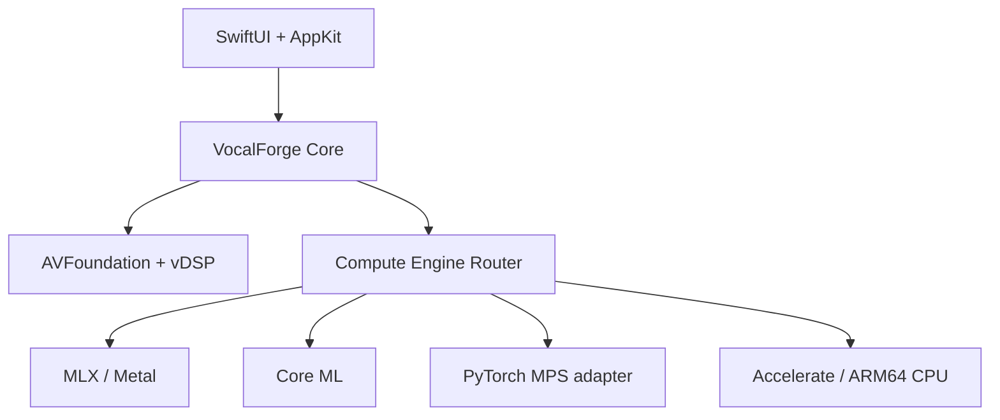

# VocalForge Studio — Arquitectura Apple Silicon

## Resumen ejecutivo

La arquitectura seleccionada combina una aplicación nativa SwiftUI/AppKit, AVFoundation/Core Audio y Accelerate para audio, un contrato de motores fuera de proceso y una futura implementación MLX como ruta principal de investigación. PyTorch MPS queda como adaptador de compatibilidad; Core ML se reserva para submodelos de inferencia con grafos convertibles y formas acotadas. No existe una única tecnología óptima para todo el pipeline.

Seed-VC se integra como motor profesional sustituible por ofrecer inferencia de canto F0 a 44.1 kHz y fine-tuning local. La validación automatizada confirmó conversión y creación de un checkpoint en Apple M1. Su condición GPL-3.0 y estado archivado impiden tratarlo como dependencia irrevocable; MLX sigue siendo la ruta futura para un motor propio.

## Matriz comparativa

| Candidato | MPS | MLX | Core ML | Entrenamiento local | M1 8 GB | Licencia / distribución | Calidad SVC | Decisión |
|---|---|---|---|---|---|---|---|---|
| Seed-VC V1/V2 | Soporte Mac añadido; PyTorch | No oficial | No seleccionada para el pipeline dinámico | Fine-tuning validado | Validado en CPU ARM64 segura; MPS completo requiere más memoria | GPL-3.0; repositorio archivado 21-nov-2025; pesos se descargan aparte | Canto F0 a 44.1 kHz | Motor profesional integrado y sustituible |
| RVC | MPS comunitario, ruta oficial centrada históricamente en CUDA | No oficial | No demostrada | Sí, arquitectura ligera | Inferencia razonable; entrenamiento no validado aquí | Código principal MIT; revisar cada peso y dependencia | Buena identidad con dataset por voz; menor generalidad zero-shot | Compatibilidad futura |
| so-vits-svc 4.x | Incidencias MPS conocidas | No oficial | No demostrada | Sí | Riesgo de fallbacks/errores | Proyecto original archivado en 2023 | Históricamente fuerte en canto | Rechazado como base |
| Amphion / Vevo | Stack de investigación, no Mac-first | No oficial | No demostrada | Principalmente investigación | Demasiado incierto | Apache-2.0 para toolkit; revisar pesos/datasets | Investigación valiosa | Banco de evaluación, no runtime inicial |
| Motor SVC propio MLX | Metal nativo vía MLX | Sí | Submodelos posibles | Sí: autograd, optimizadores y checkpointing | Diseñable con límites de memoria y chunks | MLX MIT; pesos/datos controlables | A validar mediante pruebas AB/MOS | Ruta seleccionada de I+D |

## Hechos técnicos que sostienen la decisión

MLX es desarrollado por Apple Machine Learning Research específicamente para Apple Silicon. Proporciona APIs Python, C, C++ y Swift; ejecución en CPU/GPU; evaluación perezosa; autograd; y memoria unificada sin copias explícitas entre CPU y GPU. Su API actual expone límites de memoria, caché y memoria cableada, además de limpieza de caché.¹

Core ML puede distribuir un grafo entre Neural Engine, GPU y CPU. Apple documenta que GPU/Neural Engine suelen ejecutar FP16 y CPU FP32; las formas dinámicas u operaciones no soportadas pueden cambiar la partición. Es excelente para submodelos de inferencia estables, pero no se debe prometer conversión automática de un pipeline SVC dinámico completo sin medir equivalencia y operaciones.²

AVAudioFile lee y escribe secuencialmente buffers PCM y permite acceso aleatorio por `framePosition`, una base adecuada para chunks. AVAudioEngine admite render offline, conversión, reproducción y efectos. Accelerate/vDSP evita dependencias DSP externas y usa implementaciones optimizadas por Apple.³

`ProcessInfo.thermalState` es la API pública apropiada para reaccionar a presión térmica. VocalForge reduce ritmo y concurrencia en estados serious/critical, guarda checkpoints y no cancela por defecto.

## Arquitectura



Los motores neuronales se ejecutarán fuera del proceso de interfaz. Esto permite descargar y liberar memoria, recuperar un crash sin perder el proyecto y sustituir motores. Cada trabajo se describe con JSON versionado; salida y checkpoints se escriben primero a un archivo temporal y se renombran atómicamente.

## Perfil M1 8 GB

- Un solo trabajo neuronal concurrente.
- Chunks iniciales de 8 segundos, overlap dependiente de F0/fonemas y stitching con crossfade de potencia constante.
- Modelos cargados por etapa; content encoder, F0 y vocoder no permanecen simultáneamente si la presión de memoria sube.
- Pesos memory-mapped cuando el runtime lo permita.
- FP16/BF16 solo tras comparar F0, sibilancia y estabilidad; no se reduce precisión por defecto sin prueba.
- Ultra conserva calidad mediante más pasos y etapas secuenciales, no mediante mayor batch.
- Pausas breves por `thermalState` en cargas largas del MacBook Air sin ventilador.

## `.vfvoice` v1

Un paquete es un directorio con extensión `.vfvoice`:

```text
Voice.vfvoice/
  manifest.json
  weights.safetensors
  config.json
  LICENSES/
```

El manifiesto contiene UUID, versión, arquitectura, engine ID, sample rate, rango, SHA-256 del peso, fecha, confirmación de consentimiento y procedencia. Las optimizaciones MLX/Core ML viven en `AI Models/Optimized/<model-id>/` y nunca reemplazan el paquete maestro.

## Calidad y benchmarks

La automatización incluye pruebas funcionales y de arquitectura. Los benchmarks acústicos se consideran válidos únicamente al ejecutarse en hardware físico controlado con un corpus autorizado y un motor neuronal real. Para 30 s, 1, 3 y 5 min se registrarán: wall time, peak resident memory, swap delta, thermal transitions, crash/recovery; y métricas F0 RMSE/correlación, V/UV error, intelligibility, speaker similarity, además de evaluación auditiva MOS/ABX. No se inventan números de calidad.

## Distribución y seguridad

Apple exige Developer ID válido, Hardened Runtime y timestamp para notarización; `notarytool` sustituyó a `altool`. El servicio escanea malware y firma, y el ticket se adjunta con `stapler`.⁴ Esta entrega usa firma ad-hoc porque un certificado Developer ID solo puede proceder de la cuenta Apple Developer titular. El proyecto evita JIT y excepciones amplias de Hardened Runtime. Para una futura App Store, el acceso a archivos se realiza mediante paneles seleccionados por el usuario; el runtime descargable y los procesos auxiliares requerirán una revisión específica del sandbox.

## Fuentes

1. Apple Machine Learning Research. [MLX: An array framework for Apple silicon](https://github.com/ml-explore/mlx) y [MLX documentation](https://ml-explore.github.io/mlx/build/html/index.html). Consultado en 2026.
2. Apple. [Core ML Tools — Typed Execution](https://apple.github.io/coremltools/docs-guides/source/typed-execution.html) y [Model Prediction](https://apple.github.io/coremltools/docs-guides/source/model-prediction.html).
3. Apple. [AVAudioFile](https://developer.apple.com/documentation/avfaudio/avaudiofile), [Audio Engine](https://developer.apple.com/documentation/AVFAudio/audio-engine) y [Accelerate/vDSP](https://developer.apple.com/documentation/accelerate/vdsp).
4. Apple. [Notarizing macOS software before distribution](https://developer.apple.com/documentation/security/notarizing-macos-software-before-distribution) y [Hardened Runtime](https://developer.apple.com/documentation/security/hardened-runtime).
5. Plachtaa. [Seed-VC repository](https://github.com/Plachtaa/seed-vc). GPL-3.0; archivado el 21 de noviembre de 2025.
6. RVC Project. [Retrieval-based Voice Conversion](https://github.com/RVC-Project/Retrieval-based-Voice-Conversion). MIT.
7. svc-develop-team. [so-vits-svc](https://github.com/svc-develop-team/so-vits-svc). Repositorio archivado.
8. OpenMMLab. [Amphion SVC](https://github.com/open-mmlab/Amphion/blob/main/egs/svc/README.md).
